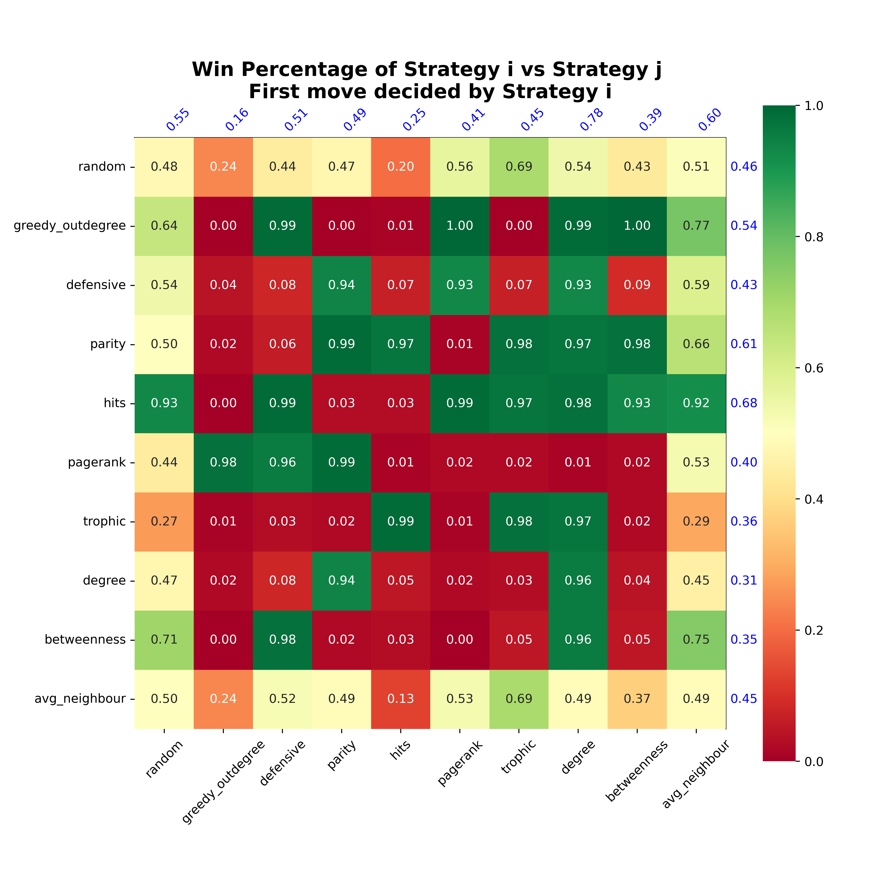

# ATLAS Game Network Analysis

This project analyzes the geographical word game **ATLAS** using complex network theory. It models countries and cities as nodes in a directed graph, where an edge exists if one location's name ends with the letter that the next location's name begins with.
<p align="center"></p>

The project encompasses data scraping, network construction, deep structural analysis, and an interactive game engine with advanced AI strategies.

---

## Table of Contents

- [About ATLAS](#about-atlas)
- [Key Features](#key-features)
- [Key Results: Link Prediction](#key-results-link-prediction)
- [Repository Structure](#repository-structure)
- [Environment Setup](#environment-setup)
- [Usage](#usage)
- [Project Workflow](#project-workflow)

---

## About ATLAS

ATLAS is a classic word game where players name geographical locations. Each name must start with the last letter of the previous one (e.g., **A**tlanti**c** → **C**anad**a** → **A**lbania). The game ends when a player cannot provide a valid, previously unused location.

This project uses network science to analyze the game's structure and develop optimal playing strategies.

---


## Key Features

- **Multi-Level Modeling**: Analyze games played with just countries, just cities, or a combined global dataset
- **Comprehensive Graph Metrics**:
  - PageRank & HITS (Hubs and Authorities)
  - Betweenness Centrality
  - Strongly Connected Components (SCC)
  - Trophic Levels & Parity Analysis
  - Average Neighbor Degree
- **Advanced Strategies**: 
  - Greedy Out-degree
  - Defensive (minimize opponent's options)
  - Parity-based strategies
  - HITS Hubs-based approaches
  - PageRank-optimized play
- **Interactive Game Engine**: 
  - Human vs AI gameplay
  - AI vs AI simulations
  - Full tournament mode to compare strategies
  <p align="center"></p>

- **Rich Visualizations**: 
  - 3D Network Graphs (interactive HTML)
  - Community Evolution Animations
  - Static structure plots and heatmaps

## Key Results: Link Prediction
We successfully trained models to predict valid moves (links) between locations with high accuracy:
- **Node2Vec + Classifier**: Achieved **100% accuracy** on the test set using random edge hiding.
- **Graph Neural Network (GraphSAGE)**: Achieved **~98% accuracy** on the test set, demonstrating the model's ability to learn structural rules of the game.


---

## Repository Structure

```
Atlas/
├── .gitignore
├── README.md
├── requirements.txt
│
├── Gephi/                 # Gephi visualization project files
│
├── data/
│   ├── cities.csv           # Processed city data
│   ├── countries.csv        # Processed country data
│   └── scrap_data.ipynb     # Data collection and cleaning notebook
│
└── code/
    ├── analysis/
    │   ├── analyse_nets.ipynb           # Main analysis notebook (metrics & centrality)
    │   ├── analyse_nodes.ipynb          # Node-level analysis
    │   ├── analyse_edges.ipynb          # Edge-level analysis
    │   ├── winning_paths.txt            # Winning path analysis results
    │   └── [subfolders: pagerank, hits, degree, between, scc, trophiclvl, parity, avg_neighbour]
    │
    ├── networks/
    │   ├── create_networks.ipynb        # Network construction notebook
    │   ├── dot/                         # Exported graphs in DOT format
    │   └── graphml/                     # Exported graphs in GraphML format
    │
    ├── visualizations/
    │   ├── create_plots.ipynb           # 2D Plotting and visualization
    │   ├── create_3D_plots.ipynb        # 3D Network visualizations
    │   ├── combined_net.html            # Interactive 3D network visualization
    │   ├── 3D/                          # Saved 3D html visualizations
    │   └── [images: city_net.png, country_net.png, combined_net.png]
    │
    ├── game/
    │   ├── atlas.py                     # Interactive game engine
    │   └── [images: win_matrix.png, etc.]
    │
    ├── bonus/
    │   ├── rl.ipynb                     # Reinforcement Learning (DQN) agent [WIP]
    │   ├── link_pred.ipynb              # Link prediction (Node2Vec & GNN)
    │   ├── gnn_model/                   # Graph Neural Network models
    │   ├── checkpoints/                 # RL model checkpoints
    │   └── node2vec/                    # Node2Vec embeddings and models
    │
    ├── community/
    │   ├── detect_community.ipynb       # Community detection analysis
    │   ├── animation.gif                # Community evolution animation
    │   ├── animation.mp4                # Video of community evolution
    │   └── communities/                 # Community snapshots
    │
    └── node2vec/
        └── embeddings.ipynb             # Node2vec embedding exploration
```

### Prerequisites

- **Python 3.11 or higher**
- **pip** (Python package manager)
- **Git** (for cloning the repository)

### Installation Steps

1. **Clone the repository**
   ```bash
   git clone https://github.com/itsNisarg/Atlas.git
   cd Atlas
   ```

2. **Create a virtual environment** (recommended)
   
   **Windows:**
   ```bash
   python -m venv venv
   venv\Scripts\activate
   ```
   
   **macOS/Linux:**
   ```bash
   python3 -m venv venv
   source venv/bin/activate
   ```

3. **Install dependencies**
   ```bash
   pip install -r requirements.txt
   ```

### Optional Dependencies

- **pygraphviz**: Required for high-quality DOT graph exports. Installation can be platform-specific:
  - **Windows**: May require [Graphviz](https://graphviz.org/download/) to be installed separately
  - **macOS**: `brew install graphviz` then `pip install pygraphviz`
  - **Linux**: `sudo apt-get install graphviz graphviz-dev` then `pip install pygraphviz`

### Key Dependencies

The project uses the following major libraries (see [requirements.txt](requirements.txt) for full list):

- `networkx`: Graph algorithms and data structures
- `pandas`, `numpy`: Data manipulation and numerical computing
- `torch` (PyTorch): For Reinforcement Learning (DQN) and GNN models
- `matplotlib`, `seaborn`: Visualization and plotting
- `scipy`: Scientific computing
- `pyvis`: Interactive network visualizations
- `node2vec`, `gensim`: Graph embedding techniques
- `python-louvain`: Community detection
- `jupyterlab`: For running analysis notebooks

---

## Usage

### Quick Start

```bash
# Activate virtual environment (if not already activated)
# Windows: venv\Scripts\activate
# macOS/Linux: source venv/bin/activate

# Run the game
python code/game/atlas.py
```

### Project Workflow

Follow these steps to reproduce the full analysis pipeline:

1. **Data Collection** (Optional - data already provided)
   ```bash
   jupyter lab data/scrap_data.ipynb
   ```
   Updates `cities.csv` and `countries.csv` from online sources

2. **Network Construction**
   ```bash
   jupyter lab code/networks/create_networks.ipynb
   ```
   Builds directed graphs for countries, cities, and combined datasets
   Exports graphs in DOT and GraphML formats

3. **Network Analysis** ⚠️ **Important Step**
   ```bash
   jupyter lab code/analysis/analyse_nets.ipynb
   ```
   Calculates centrality metrics, PageRank, HITS, SCC, trophic levels, etc.
   Generates CSV files in `code/analysis/*/` subdirectories
   **These CSV files are required by the game engine for AI strategies**

4. **Visualization**
   ```bash
   jupyter lab code/visualizations/create_plots.ipynb
   ```
   Generates network visualizations and statistical plots

5. **Play the Game**
   ```bash
   python code/game/atlas.py
   ```
   Choose from:
   - **Interactive Mode**: Play against AI
   - **Simulation Mode**: Watch AI vs AI games
   - **Tournament Mode**: Compare all strategies

### Game Modes

The game engine (`atlas.py`) offers three modes:

- **Human vs AI**: Test your skills against different AI strategies
- **AI vs AI**: Observe how different strategies perform against each other
- **Tournament**: Run a complete round-robin tournament to identify the best strategy

---

## Additional Analysis

Beyond the core workflow, the repository includes:

- **Community Detection** (`code/community/detect_community.ipynb`): Identify clusters in the network
- **Node Embeddings** (`code/node2vec/embeddings.ipynb`): Learn vector representations of locations
- **Link Prediction** (`code/bonus/link_pred.ipynb`): Predict potential new edges

---

_This project is for research and educational purposes._
